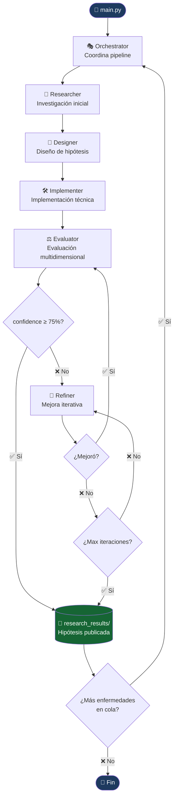
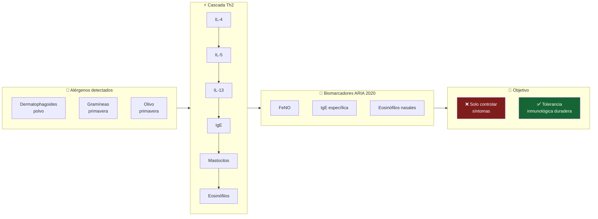
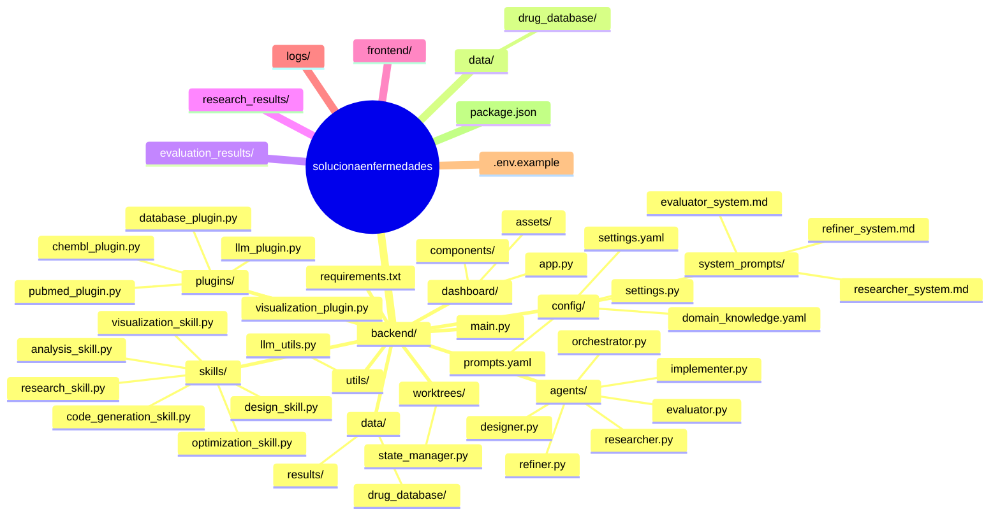
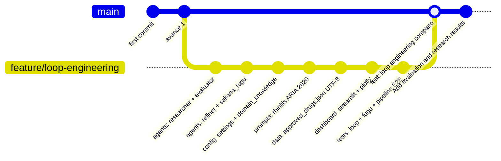

<div align="center">

# 🧬 Pharma Loop Engineering

**Motor evolutivo de reposicionamiento farmacéutico con agentes multi-IA**

[](https://python.org)
[](https://huggingface.co/Qwen)
[](https://docs.python.org/3/library/asyncio.html)
[](https://streamlit.io)
[](LICENSE)
[]()

*Encuentra curas — no solo tratamientos — evolucionando hipótesis sobre combinaciones de fármacos ya aprobados*

[Ver Repositorio](https://github.com/AngelTroncoso/solucionaenfermedades) · [Reportar Bug](https://github.com/AngelTroncoso/solucionaenfermedades/issues)

</div>

---

## ✦ Qué hace

Pharma Loop Engineering implementa un **pipeline de 6 agentes de IA** para descubrir usos terapéuticos nuevos en fármacos ya aprobados por FDA/EMA. En lugar de sintetizar nuevas moléculas, el sistema analiza perfiles farmacológicos existentes y refina hipótesis iterativamente hasta alcanzar plausibilidad clínica.

**Enfermedades objetivo prioritarias:**
- 🤧 Rinitis alérgica crónica (primaveral y al polvo) — pipeline especializado con criterios ARIA 2020
- Extensible a cualquier condición Th2-mediada o inflamatoria

> **Restricción de modelos:** toda la inferencia LLM corre exclusivamente en **modelos Qwen** vía DashScope (Alibaba Cloud) o OpenRouter. Sin GPT, Claude, Gemini ni Llama.

---

## 🏗️ Arquitectura del Sistema



---

## 🧬 Pipeline de Rinitis Alérgica



---

## 📦 Estructura del Proyecto



---

## 🚀 Inicio Rápido

```bash
git clone https://github.com/AngelTroncoso/solucionaenfermedades.git
cd solucionaenfermedades
pip install -r requirements.txt
cp .env.example .env          # agrega tu API key de OpenRouter
python main.py
```

**Dashboard:**
```bash
# Desde el directorio backend/
cd backend
python -m streamlit run dashboard/app.py
```

**Tests:**
```bash
pytest tests/ -v --asyncio-mode=auto
```

---

## ⚙️ Configuración

```python
# config/settings.py
MODEL_REASONING   = "qwen3-235b-a22b"          # Razonamiento profundo (Researcher)
MODEL_EVALUATION  = "qwen3-32b"                # Evaluación rápida
MODEL_REFINER     = "qwen2.5-72b-instruct"    # Refinamiento detallado
MODEL_LIGHT       = "qwen2.5-7b-instruct"       # Tareas auxiliares
MODEL_EMBEDDINGS  = "text-embedding-v3"        # Búsqueda semántica

MAX_ITERATIONS    = 10
FITNESS_THRESHOLD = 0.80
POPULATION_SIZE   = 10
MUTATION_RATE     = 0.30
EARLY_STOP_ROUNDS = 3
CHECKPOINT_EVERY  = 3
```

```env
# .env
DASHSCOPE_API_KEY=your_dashscope_key_here
OPENROUTER_API_KEY=your_openrouter_key_here
LLM_PROVIDER=dashscope  # o "openrouter"

MAX_ITERATIONS=10
FITNESS_THRESHOLD=0.80
```

---

## 🧪 Base de Fármacos Aprobados


---


## 📊 Historial del Repositorio



---

## 🤝 Contribuir

Proyecto de investigación activa. PRs e issues bienvenidos, especialmente:
- Nuevas enfermedades objetivo con perfil Th2/inflamatorio
- Fármacos aprobados adicionales con evidencia inmunomoduladora
- Mejoras en los pesos del fitness multidimensional

---

<div align="center">

Hecho con 🧬 y Python async · Powered exclusively by [Qwen](https://huggingface.co/Qwen)

**Santiago de Chile · 2026**

</div>
