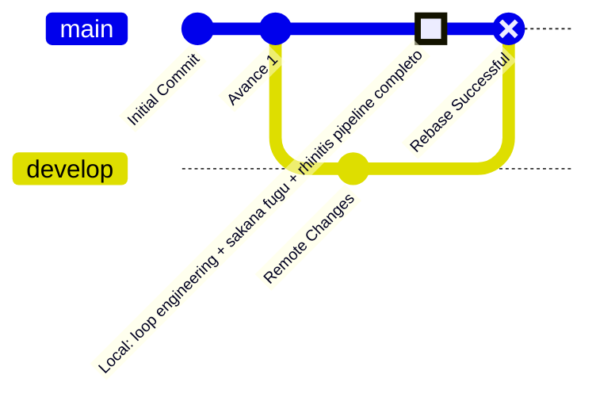
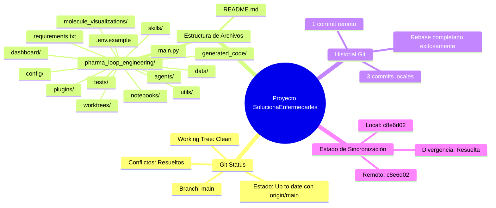
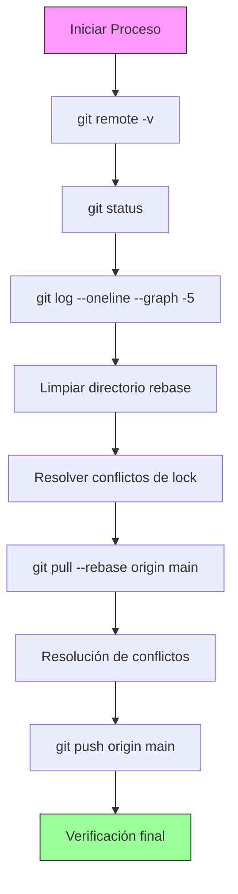
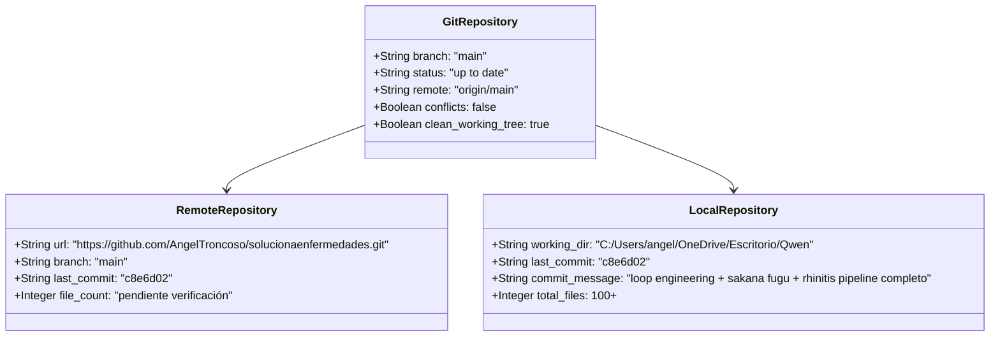

# Análisis del Estado del Proyecto - Diagrama Mermaid



## Estado Actual del Proyecto

### Estructura del Repositorio


## Flujo de Trabajo Completado



## Análisis de Conflictos Resueltos

```mermaid
gantt
    title Resolución de Conflictos Git
    dateFormat  HH:mm
    section Proceso
    Identificar rebase en progreso   :a1, 00:00, 5m
    Limpiar directorio rebase-merge   :a2, after a1, 3m
    Resolver lock de índice          :a3, after a2, 4m
    Abortar rebase existente         :a4, after a3, 2m
    Reiniciar pull --rebase          :a5, after a4, 3m
    Resolver conflicto dashboard/     :a6, after a5, 2m
    Completar rebase                 :a7, after a6, 1m
```



## Estado Final del Repositorio



## Recomendaciones

1. **Verificar push exitoso**: Confirmar que todos los cambios locales están en el remoto
2. **Contar archivos en GitHub**: Verificar que la estructura de directorios se mantuvo intacta
3. **Validar pipeline**: Asegurar que el pipeline de rhinitis funciona correctamente
4. **Documentar proceso**: Registrar los pasos de resolución de conflictos para referencia futura

## Comandos Pendientes

```bash
# Verificar estado final
git log --oneline --graph -5

# Contar archivos en el repositorio local
find . -type f | wc -l

# Verificar conexión remota
git remote show origin